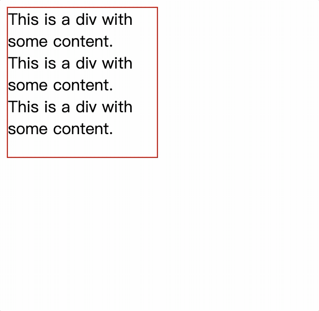

# css3 过渡和动画

::: tip 说明
在 css3 引入 transition 之前 css 没有时间轴，所有的变化都是在瞬间完成的
:::

## 过渡 transition

transition 的作用在于，指定状态变化所需要的时间。

```css
div {
  width: 100px;
  height: 100px;
}
div:hover {
  width: 300px;
  height: 300px;
}
div {
  transition: 1s;
}
```


